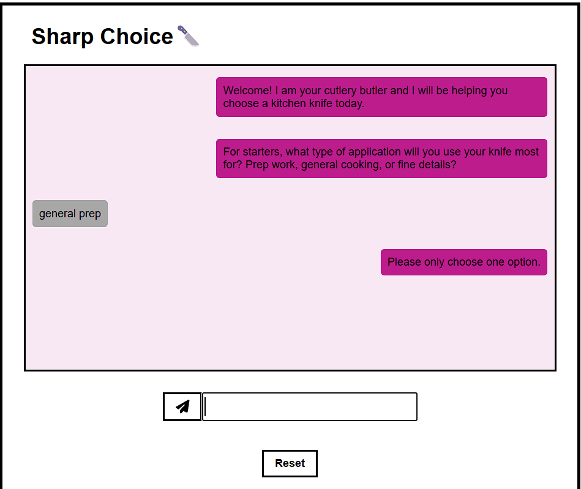
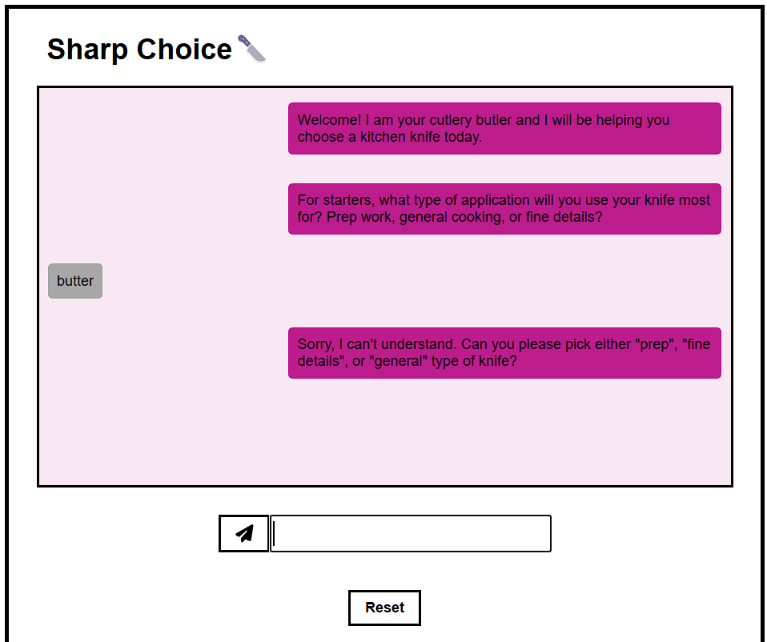
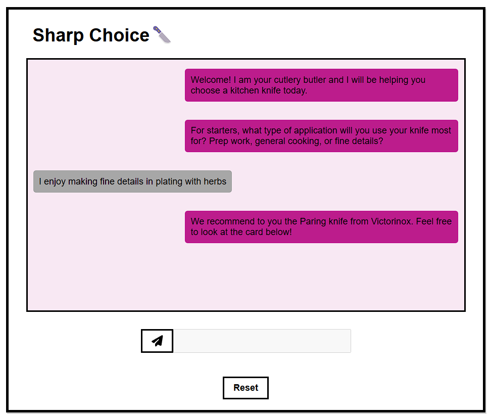
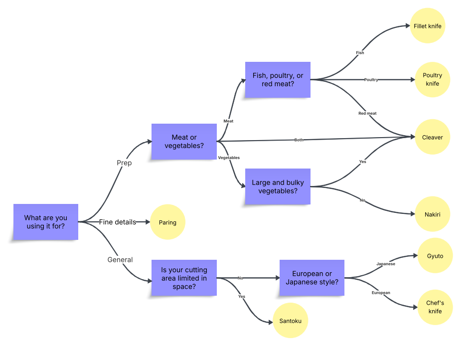
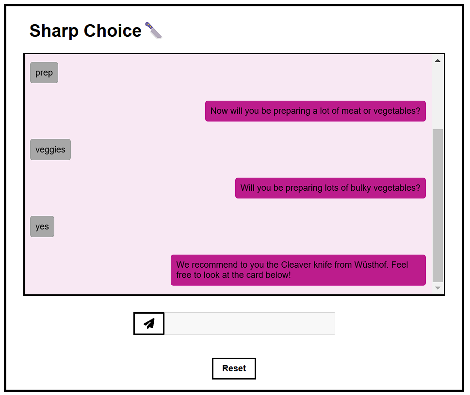
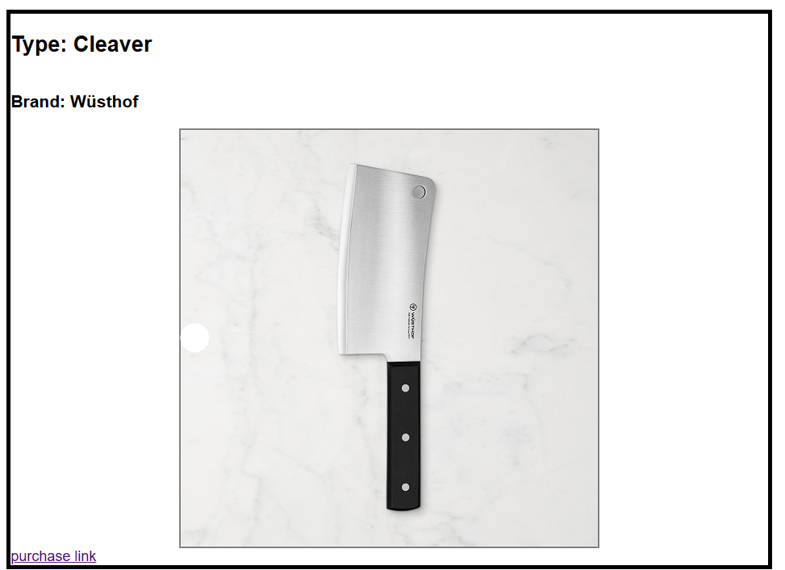

# eGain Take Home

## Setup

Note: if you don't wish to deploy this on your machine you can test it here [https://evan-nishi.github.io/eGain-Take-Home/](https://evan-nishi.github.io/eGain-Take-Home/)

1. Clone the repo
Clone the repo to your device.

2. Install packages
Run `npm i` to install packages.  If npm is not installed on your machine, follow instructions [here](https://docs.npmjs.com/downloading-and-installing-node-js-and-npm).

3. Run program
Run `npm run dev` to run the program.

## Edge Cases Covered
1. Multiple keywords
    If the user's message contain multiple keywords for the dialog option, the system requests the user to only use one as shown below.

2. No keywords used
    If the user's message doesn't contain any keyword options for the dialog, the system requests the user use one and enumerates them.

3. Alternate keyword used
    Certain routes have alternate keywords.  For example "yep", "yes", "yea", and "definitely" all result in the same output. 

4. Additional text
    Any additional text not relevant to the dialog flow is parsed out.  

## Diagram

## Examples

### Choosing prep -> veggies -> yes

### Recommendation
The above flow leads to the following recommendation

